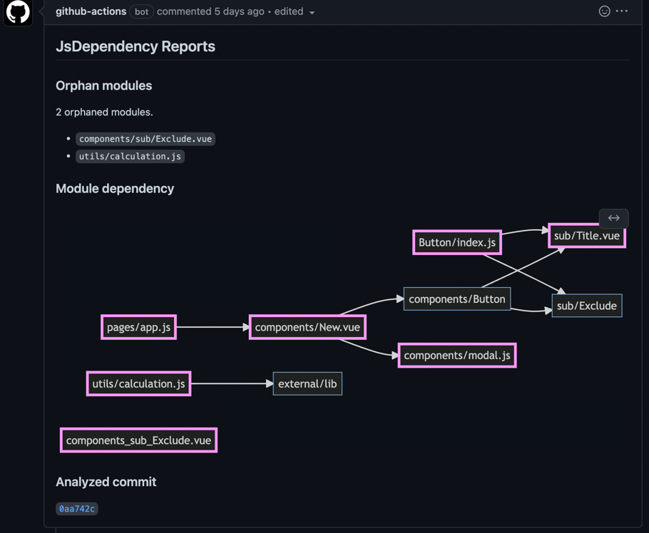

# pull_request_comment_of_javascript_dependency_graph



[Example Pull Request #1 · junara/test_js_dependency_gh_action](https://github.com/junara/test_js_dependency_gh_action/pull/1)

## Description
Show dependency graph of javascript file to pull request comment. Using [junara/js_dependency](https://github.com/junara/js_dependency) gem.

## Usage

Example GitHub Actions yaml. 

[test_js_dependency_gh_action/main.yml at main](https://github.com/junara/test_js_dependency_gh_action/blob/main/.github/workflows/main.yml)

```yaml
name: Add js_dependency analysis report in pull request comment
on:
  pull_request:

jobs:
  js_dependency:
    name: Export Mermaid by js_dependency
    runs-on: ubuntu-latest
    steps:
      - uses: junara/pull_request_comment_of_javascript_dependency_graph@main
        with:
          src_path: src
          child_analyze_level: 2
          parent_analyze_level: 2
          name_level: 2
          alias_paths: "@:./pages"
          exclude_output_names: "pages"
          github_token: ${{ secrets.GITHUB_TOKEN }}
```

Output example. 

[Pull Request #1 · junara/test_js_dependency_gh_action](https://github.com/junara/test_js_dependency_gh_action/pull/1)

* Border colored pink boxes are changed files

## Inputs

* src_path
  * JavaScript source path.
* child_analyze_level
  * Display level of child dependencies.
* parent_analyze_level
  * Display level of parent dependencies.
* name_level
  * Display level of name.
* alias_paths
  * Specify alias path like `"@:./pages"`
* exclude_output_names
  * If you want to exclude output name, specify it like `"pages"`. And if you want to exclude multiple output names, specify it like `"pages components"`.
* github_token
  * `${{ secrets.GITHUB_TOKEN }}`

## More information
If you want more analysis, see [junara/js_dependency](https://github.com/junara/js_dependency).

## License
MIT License

